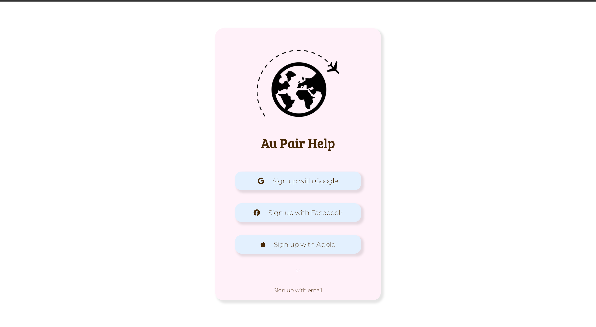
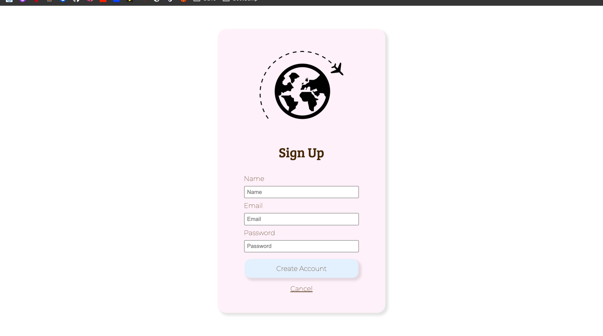
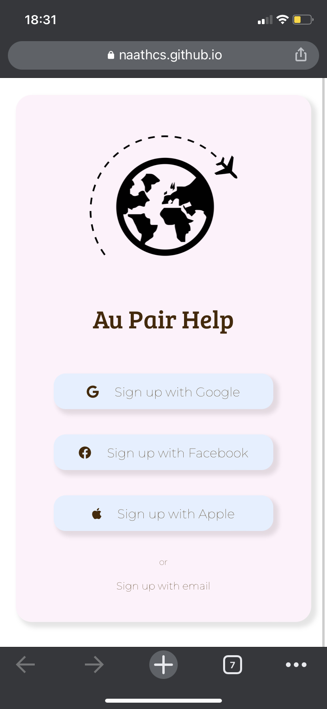

# Sign Up Page - Daily UI

This is a solution to the First DailyUI challenge that I received. Challenges help you improve your coding skills by building realistic projects.

## Table of contents

- [Overview](#overview)
  - [The challenge](#the-project)
  - [Screenshot](#screenshot)
  - [Links](#links)
- [My process](#my-process)
  - [Built with](#built-with)
  - [What I learned](#what-i-learned)
  - [Useful resources](#useful-resources)
- [Author](#author)

## Overview

### The project

The project is based on the challenge from the [DailyUI](https://www.dailyui.co/) website, where everyday you get a new UI challenge.
The UI final design is first posted on my Twitter. I will then start to code the pages I created using my current abilities and what I am also currently learning.

Users should be able to:

- See hover states for interactive elements.
- Each link is interactive and will send the user to a different link.

### Screenshot
*** UPDATE WITH SCREENSHOTS ***

### Links

- Solution URL: [Github Code](https://github.com/naathcs/Sign-Up-Pages)
- Live Site URL: [Github Pages](https://naathcs.github.io/Sign-Up-Pages/)

## My process

I started creating the `index` html page with the main buttons and texts. I also added images and icons from [FontAwesome](https://fontawesome.com/) to visually separate each button with each logo.
I created a `README` file and a `style-guide` file and added information such as : color, font family, which would be the best width for the card being created.
I also created my own favicon to use on this and future projects.

It is a mobile page, but I decided to create as a card so it can be viewed from both mobile and desktop/laptop.

Adding a `reset` CSS page to the project so I can freely use CSS to achieve the goal of the design.

After the index page, I started working on the CSS, using my last [FrontEndMentor challenge](https://www.frontendmentor.io/solutions/order-summary-card-solution-ryKGnnOEc) as a reference to build the css of this one.

Practicing flex box and media query, and also creating a color palete without checking any website with pre-made ones.
The anchor buttons were more complicated. Center the text and the icons were more tricky than I expected but I manage to do it using one of the alignment options from flex box display.

After finishing and testing the first page, I started the second one using the same CSS files and a similar HTML structure.

Updated after 20+ days, it was quite interesting to figure out where I left the project just reading the documentation. I learned that the `Sign Up Page` just needed some CSS minor updates. At the bottom of the `main.css` I added margin, padding, alignment and width to the necessary classes.

The main issue I was having was due to the fact that I did not add an image to the second page. As a result it turned out much smaller than the main one. My intention was to not add the image at all, but in order to make both pages the same size, I would have to create a third CSS file to duplicate the index page size. So I decided to add the image and it was not visually ugly so I will keep the change as final.

Adding final links to the buttons.
`Create Account Button does not have any link in it.  `

### Built with

- Semantic HTML5 markup
- CSS custom properties
- Flexbox
- Mobile-first workflow
- CSS Media Query
- BEM methodology

### What I learned

I decided to created this small project following a design that I created instead of a challenge from a website. Starting everything from scratch was very interesting. From the color palete to the name of the classes I had to make sure that everything was following the methodology that I chose to use for the code, if I was using the right color from the design.

I used a couple of my other projects as example so I did not feel lost creating the HTML since it was my first time doing this.

Using logos from different websites, adding properly to the code without misplacing when using CSS. Tracking errors, following up to find out how to solve and the best way to do it. And in the process also making sure that the code was clean and easy to read or to browse in case of a line change is necessary.

It was interesting and fun to see a project coming to life and working. For this project, patience was definitely the most important. Despite the 20+ days gap of no coding, I found it easy to find where I stopped and continue and finish the project. Which means I created the code clean enough to be easy to spot the last update and continue from there.

### Useful resources

- [Travel Logo](https://upload.wikimedia.org/wikipedia/commons/thumb/f/fb/Noun_15537_ccElliotVerhaeren_travel.svg/1200px-Noun_15537_ccElliotVerhaeren_travel.svg.png) - Logo downloaded from Google Images to be used as a similar resource for the code.
- [FontAwesome](https://fontawesome.com/) - website used for the social media logos used on the buttons.
- [placeholder](https://developer.mozilla.org/en-US/docs/Web/HTML/Element/input) - Looking for aa way to add a hint to the input field with the need to delete what is being written I found the placeholder attribute. Unfortunately the attribute is not semantically useful. I used anyway as a way to see what each field is about for this project.
- [Centering Object](https://stackoverflow.com/questions/2812770/add-centered-text-to-the-middle-of-a-horizontal-rule) - Research on how to center two different child divs inside the parent one.
- [Centering Object](https://www.w3schools.com/css/css_align.asp) - Also a research on how to center two different child divs inside the parent one.
- [Color Picker](https://www.google.com/search?q=hex+color+picker&oq=hex+col&aqs=chrome.1.0i67i433j0i433i512j69i57j0i67l3j0i512j69i60.2276j0j1&sourceid=chrome&ie=UTF-8) - Hexadecimal Color Picker.
- [Color Converter](https://rgbacolorpicker.com/hex-to-rgba) - Converting hexadecimal to RGBA color.
- [Input Attributes Removal](https://www.codegrepper.com/code-examples/javascript/remove+input+value) - Researching on how to remove the value of an input and add a hint instead.

## Author

- Website - [Github](https://github.com/naathcs)
- LinkedIn - [Nathalia](https://www.linkedin.com/in/naathcs/)
- Twitter - [@csnaath](https://twitter.com/csnaath)
- Instagram - [@naath.cs](https://instagram.com/naath.cs)
